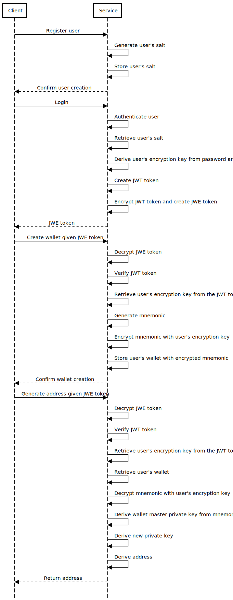

# zwallet

Proof of Concept (PoC) of a web service to manage cryptocurrency wallets.

The service supports the following operations for an authenticated user:

1. create a hierarchical deterministic wallet from a mnemonic for the user;
2. generate a new address in the user's wallet;
3. list the addresses in the user's wallet;
4. get an address in the user’s wallet.

The package also includes user registration and authentication.

## Trying out

1. Clone the repository:

   ```bash
   git clone git@github.com:91nunocosta/zwallet.git
   ```

2. Change to the project directory:

   ```bash
   cd zwallet
   ```

3. Install:

    ```bash
    pip install -e .
    ```

3. Run the service with the example db.

    ```bash
    ./start-local.sh
    ```

4. Open the Open API docs at [http://127.0.0.1:8000/docs](http://127.0.0.1:8000/docs).

5. Authenticate with username `bob` and password `pass`, following the steps described
[here](https://fastapi.tiangolo.com/tutorial/security/oauth2-jwt/#check-it).

6. Try out the endpoints (see how [here](https://fastapi.tiangolo.com/#interactive-api-docs-upgrade)).

## Security

The service protects the user's passwords by hashing them.

The service protects the wallets' mnemonics with the following protocol:

- generates and stores a _salt_ on user registration
- derives the user's encryption key using a Password-Based Key Derivation Function
on user login, using the password and stored salt
- adds the encryption key to the JWT authentication token
- encrypts the JWT token and wraps it in a JWE token
- encrypts the mnemonics when creating the user's wallet using the user encryption key
- decrypts the mnemonic when accessing the user's wallet using the user encryption key

The following image shows the described protocol.



## Project structure

There are two modules at the project root:

- [zwallet](./zwallet) - the web service implementation
- [tests](./tests)

[zwallet](./zwallet) contains the following modules:

- [api](./zwallet/api.py) -  ASGI application implementing the service
- [dependencies](./zwallet/dependencies.py)- dependencies to inject in the path functions
- [jwt](./zwallet/jwt.py) - access token creation and parsing
- [auth](./zwallet/auth) - user registration and login
- [wallets](./zwallet/wallets) - wallets management
- [run](./zwallet/run.py) - script for running uvicorn with the ASGI application in [api](./api)

[zwallet.wallets](./zwallet/wallets) contains the following modules:

- [hdwallet](./zwallet/wallets/hdwallet.py) - a factory that selects the appropriate
    hierarchical deterministic wallet implementation for a given currency
- [models](./zwallet/wallets/models.py) - defines the entities
- [wallets](./zwallet/wallets/wallets.py) - the wallets business logic
- [router](./zwallet/wallets/router.py) - the wallets endpoints

**Note**: if you want to support new currencies, extend [zwallet.wallets.hdwallet](./zwallet/wallets/hdwallet.py).

## Next steps

This PoC focuses on providing minimal and secure operations for cryptocurrency wallet management.
It doesn't explore database management, deployment, or scalability aspects.
Moving it to a web service in production would require steps as the following:

1. Encapsulating the web service in a docker image.

2. Configuring a scalable DBMS (e.g., PostgreSQL).

3. Setting-up database migrations (e.g., with Alembic).

4. Moving [authentication](./zwallet/auth) to a dedicated service.

## Linting and testing

1. Clone the repository:

   ```bash
   git clone git@github.com:91nunocosta/zwallet.git
   ```

2. Open the project directory:

   ```bash
   cd zwallet
   ```

3. Install [_poetry_](https://python-poetry.org/) _package and dependency manager_.
Follow the [poetry installation guide](https://python-poetry.org/docs/#installation).
Chose the method that is more convenient to you, for example:

   ```bash
   curl -sSL\
        https://raw.githubusercontent.com/python-poetry/poetry/master/get-poetry.py \
      | python -
   ```

4. Create a new virtual environment (managed by _poetry_) with the project dependencies:

   ```bash
   poetry install --with lint --with tox
   ```

5. Activate the virtual environment:

   ```bash
   poetry shell
   ```

6. Run the linters:

    ```bash
    pre-commit run --all-files
    ```

7. Run the tests:

    ```bash
    tox
    ```
